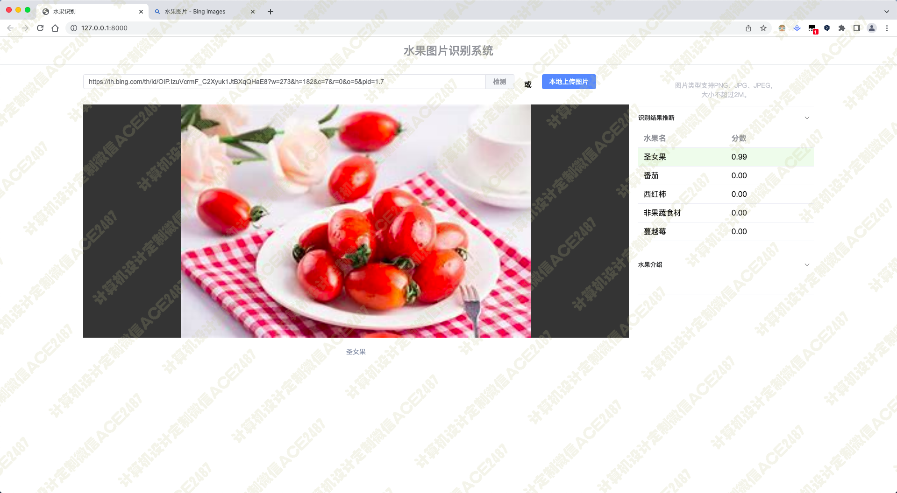
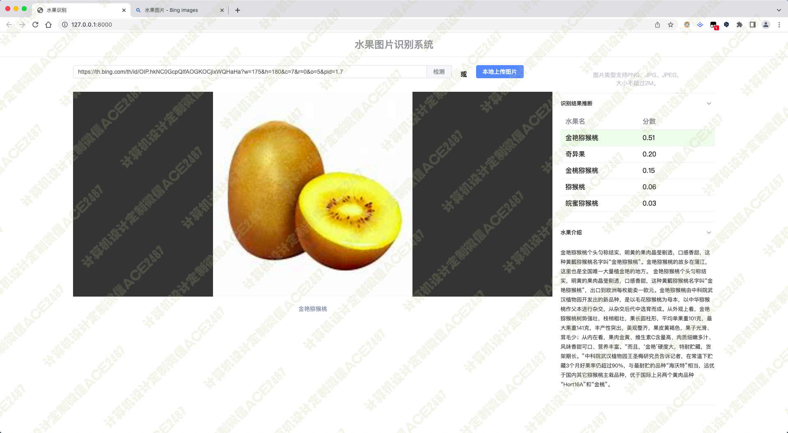
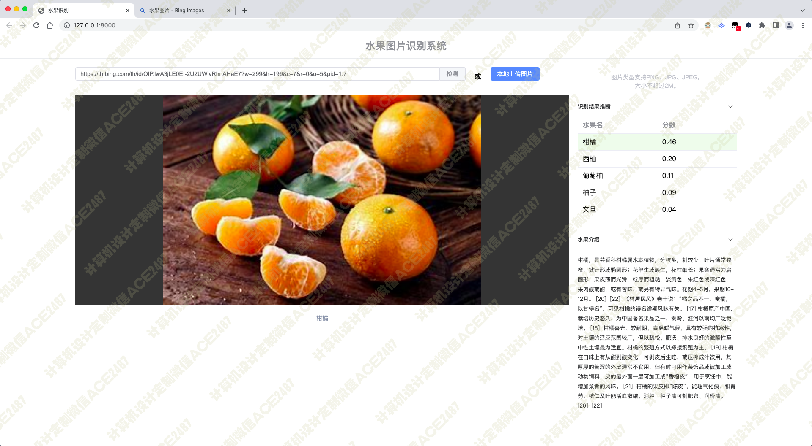
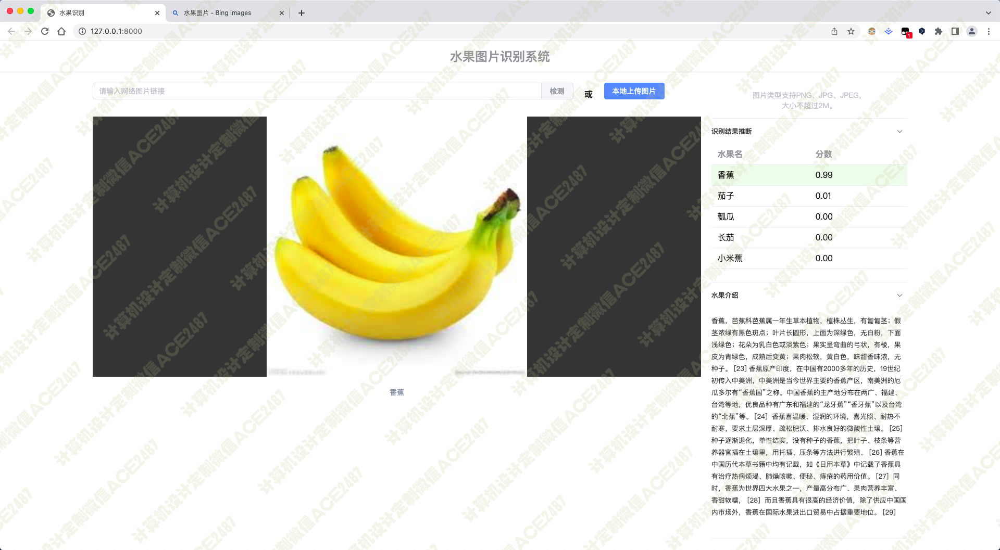
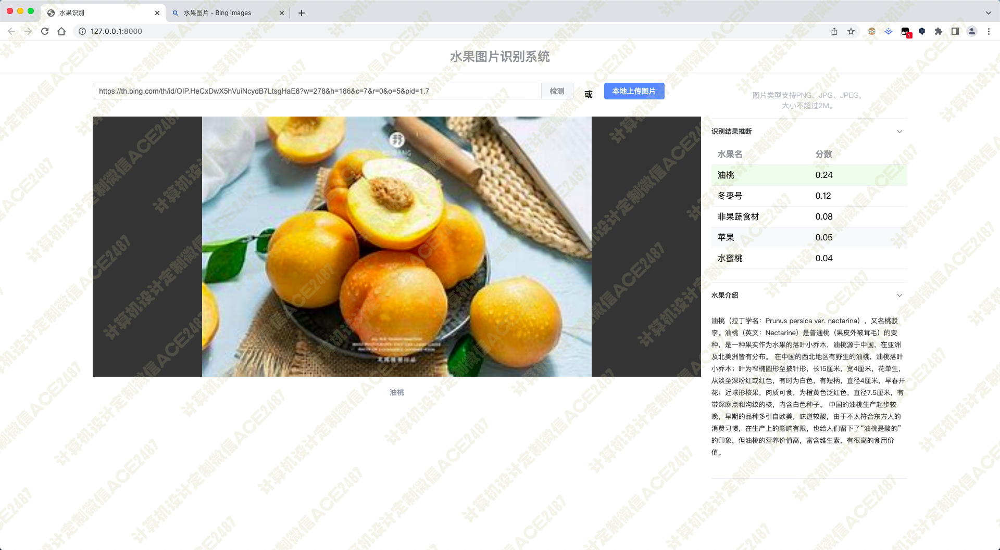
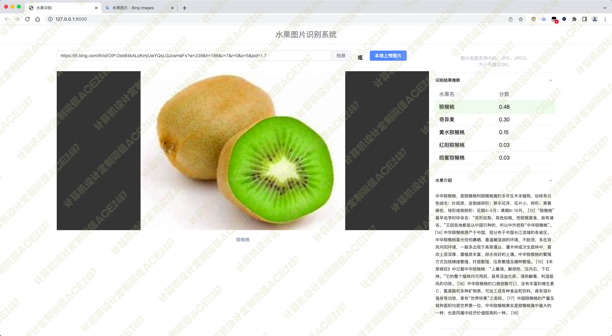

# 026 基于深度学习的水果识别系统-设计展示

> **代码有偿获取 可接受定制 微信联系方式: csbysj2020 或 ACE2487，备注(BS)**

> 

> 

## 介绍

具体实现分为以下几个步骤：
1. 数据集准备：从互联网上采集水果图片，并将其划分成训练集、验证集和测试集，以便用来训练和测试模型。
2. 模型构建：使用 PyTorch 来构建深度学习模型，常用的有 AlexNet、VGG、ResNet 等。根据实验情况，可以选择不同的模型。
3. 训练模型：使用准备好的训练集数据对模型进行训练，调整网络参数，使其能够更加准确地预测果蔬类型。同时在验证集上进行验证，防止过拟合。
4. 接口调用：使用 Python Django 来搭建后端接口，将训练好的模型加载进来，当用户上传一张水果照片时，调用接口，根据图像识别出水果种类，返回识别出的水果类型和信度值给前端。对于网络图片中的水果类型，直接调用接口即可。
5. 前端展示：使用 vue 框架来构建前端页面，展示上传的图片和接口返回的结果。同时，在识别出水果的情况下，提供水果的介绍、图片等相关信息，增强用户体验。

需要注意的是，深度学习模型的准确性和性能是需要大量数据和时间支持的，因此在实际应用中需要考虑到模型的精度和处理速度之间的平衡。另外，也要注意用户上传的图片质量，应该进行预处理，消除背景干扰和噪声，以提高识别准确度和速度。

具体来说，这个系统的输入是一张水果的图片，输出是该水果的名称和识别分数。在这个过程中，系统需要对输入的图片进行预处理，包括图像的归一化、缩放和裁剪等，以确保能够适应不同大小和分辨率的图片，同时也需要对图像进行噪声和背景干扰去除处理。

接下来，通过加载训练好的深度学习模型，对图片进行特征提取和预测。常用的深度学习模型包括卷积神经网络 (Convolutional Neural Networks，CNNs) 和循环神经网络 (Recurrent Neural Networks，RNNs) 等。其中，卷积神经网络是最常用的模型之一，在水果识别系统中也得到了广泛应用。其主要思想是通过多层卷积、池化和全连接层等操作，将复杂的输入数据映射到抽象的特征空间中，从而实现准确的分类和识别。

作为深度学习技术的一项关键特点，我们需要通过大量的数据集进行训练和调整，从而使得训练出来的模型具有更好的泛化能力。因此在水果识别系统中，我们需要构建一个包含大量不同类型和角度水果的数据集，用于训练和测试深度学习模型。同时，还需要进行数据增强、过拟合等问题的处理，以提高深度学习模型的泛化能力和预测准确率。

最终，通过前端页面的展示，用户可以上传一张水果图片，后端会返回识别出的水果名称和对应的信度值，同时还会提供水果介绍、图片和其他相关信息。对于一些特殊情况，如无法识别或识别不准确等，系统也应该及时响应并给出相应的提示和建议。

## 技术栈

python django vue pytorch 深度学习 根据拍摄照片识别图片中果蔬名称 可识别网络图片中的水果类型 可本地上传图片识别水果 推断出识别水果并给出识别分数(可信度) 识别后给出水果介绍

## 视频

> **点击查看 \>\>\> [https://www.bilibili.com/video/BV19k4y1t7Tw/](https://www.bilibili.com/video/BV19k4y1t7Tw/)**

## 截图

